# GAMES101 课程作业

课程主页：[https://sites.cs.ucsb.edu/~lingqi/teaching/games101.html](https://sites.cs.ucsb.edu/~lingqi/teaching/games101.html)

## 作业结果截图

    
<strong>作业 1</strong>

    <table><tr>
        <td>
    		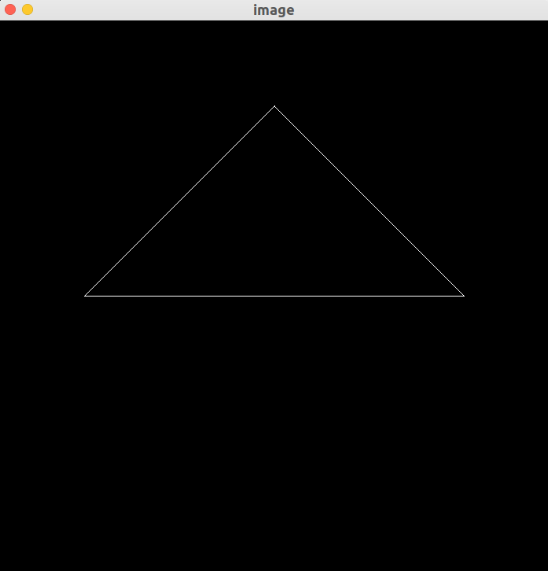
        </td>
    </tr></table>

    
<strong>作业 2</strong>

    <table><tr>
		<td>
            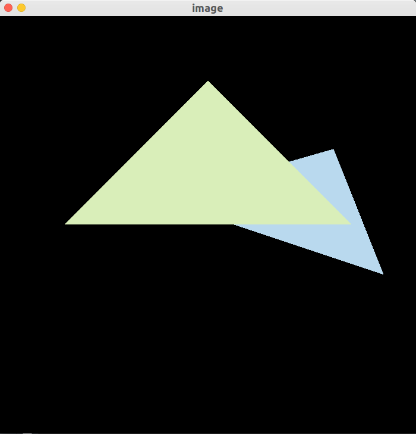
            
光栅化

        </td>
		<td>
            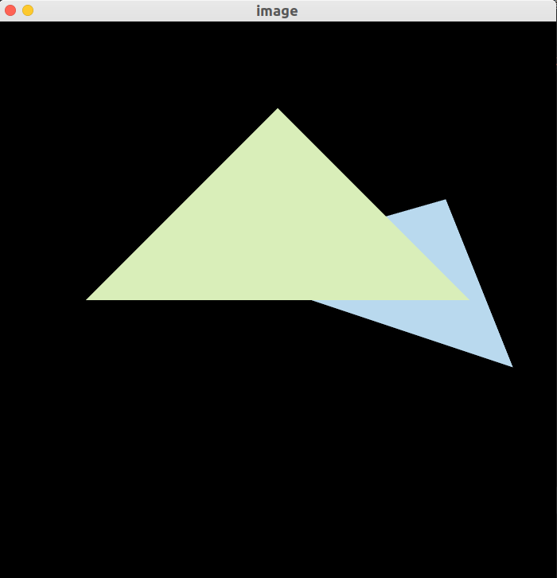
            
超采样抗锯齿

        </td>
	</tr></table>

    
<strong>作业 3</strong>

    <table><tr>
        <td>
    		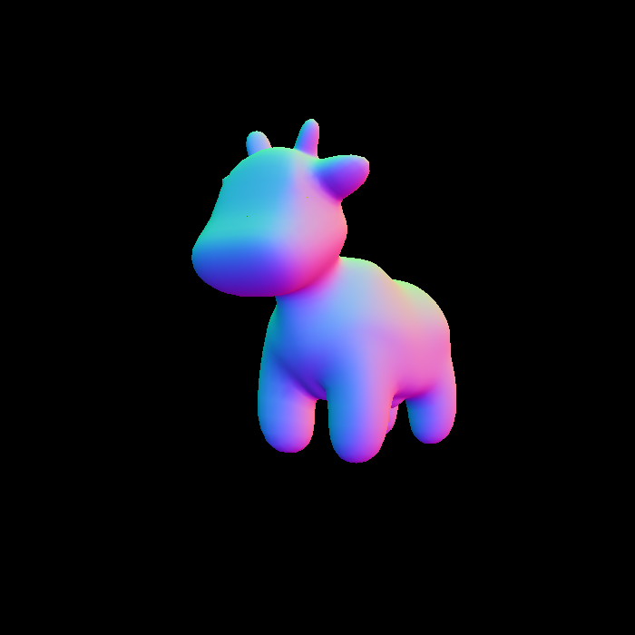
            
normal

        </td>
        <td>
    		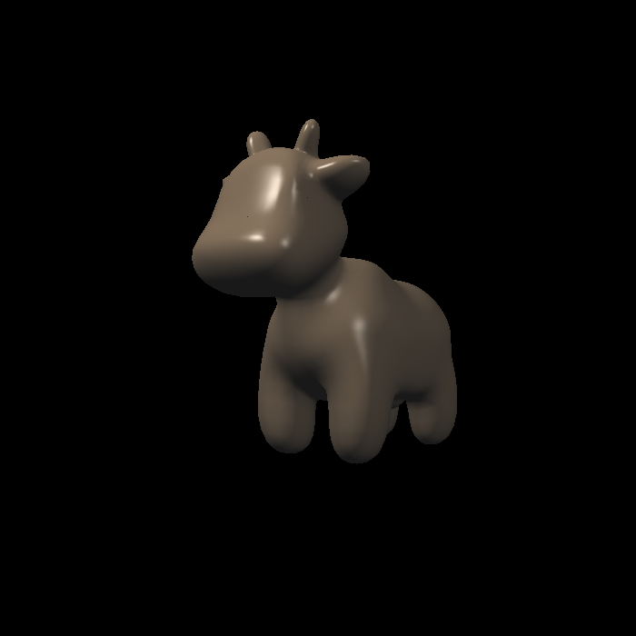
            
phong

        </td>
        <td>
    		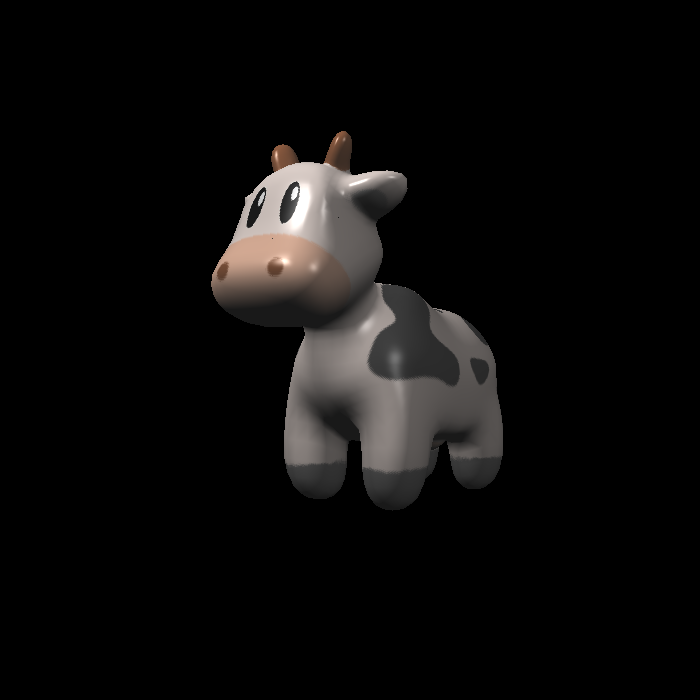
            
texture

        </td>
        <td>
    		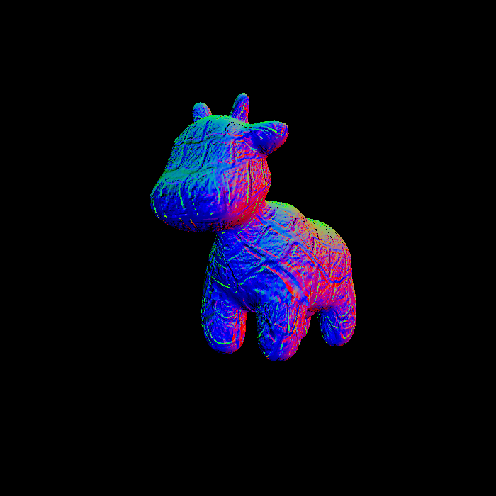
            
bump

        </td>
        <td>
    		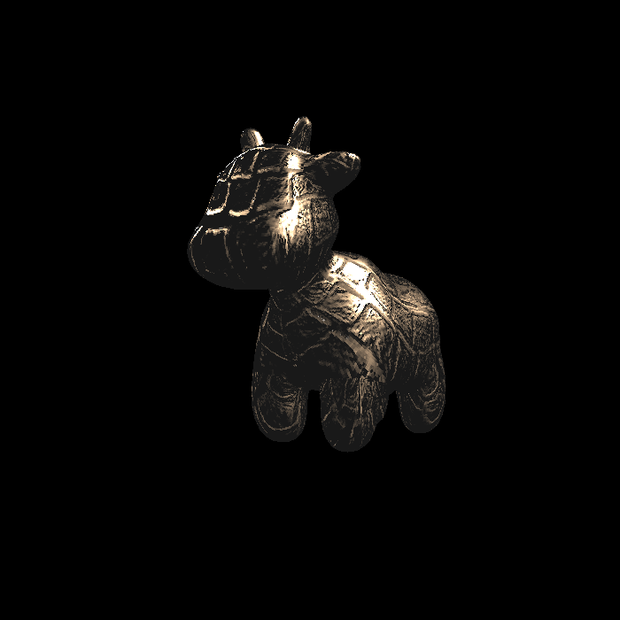
            
displacement

        </td>
    </tr></table>

    
<strong>作业 4</strong>

    <table><tr>
        <td>
    		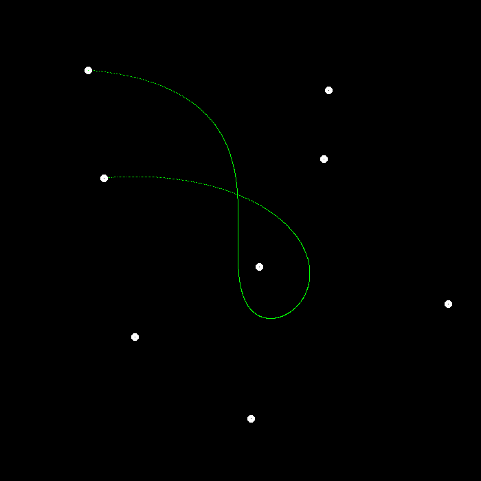
        </td>
        <td>
    		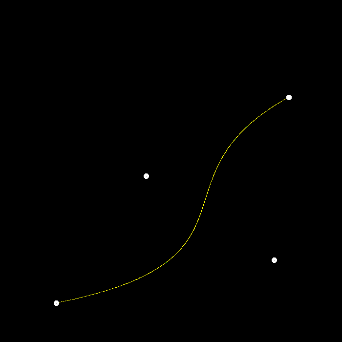
        </td>
    </tr></table>

    
<strong>作业 5</strong>

    <table><tr>
        <td>
    		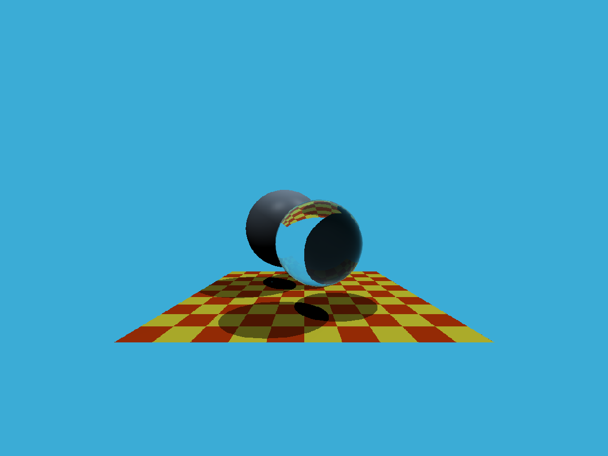
        </td>
    </tr></table>

